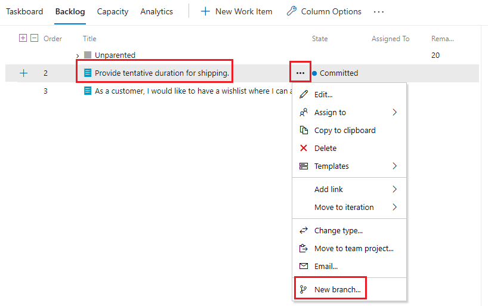
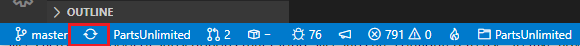
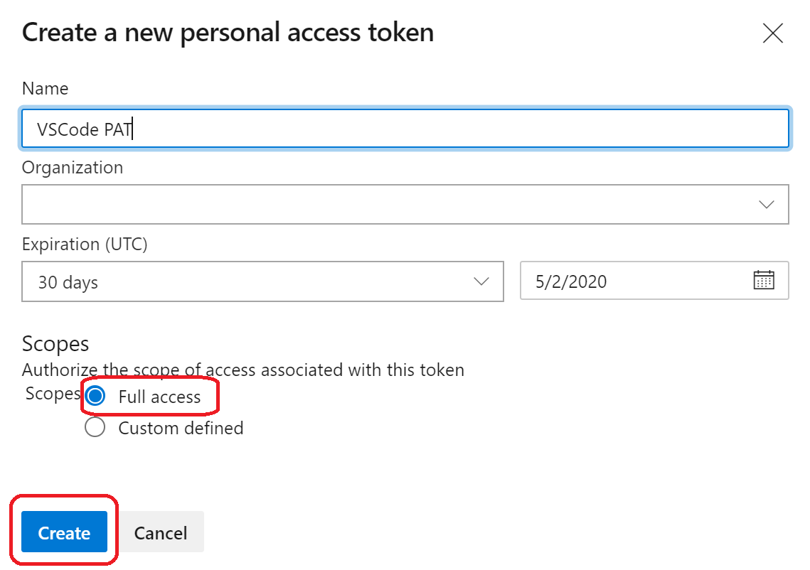
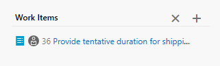
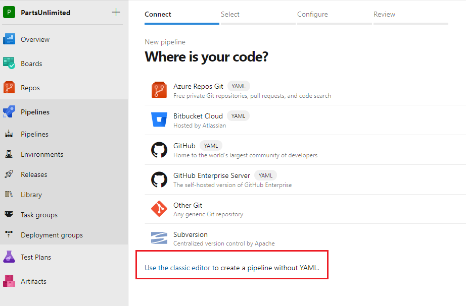
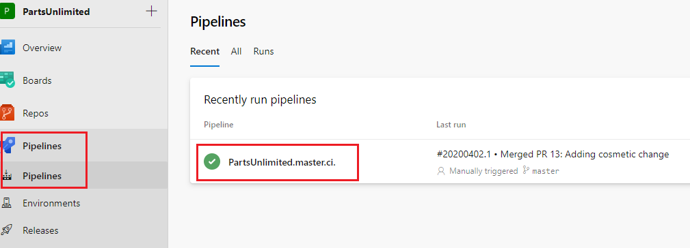

# Activate Azure with DevOps
## Module 06: End-to-End DevOps - Lab 6.2 - Develop and Test
### Student Lab Manual
**Conditions and Terms of Use**  
**Microsoft Confidential - For Internal Use Only**

This training package is proprietary and confidential and is intended only for uses described in the training materials. Content and software is provided to you under a Non-Disclosure Agreement and cannot be distributed. Copying or disclosing all or any portion of the content and/or software included in such packages is strictly prohibited.

The contents of this package are for informational and training purposes only and are provided "as is" without warranty of any kind, whether express or implied, including but not limited to the implied warranties of merchantability, fitness for a particular purpose, and non-infringement.

Training package content, including URLs and other Internet Web site references, is subject to change without notice. Because Microsoft must respond to changing market conditions, the content should not be interpreted to be a commitment on the part of Microsoft, and Microsoft cannot guarantee the accuracy of any information presented after the date of publication. Unless otherwise noted, the companies, organizations, products, domain names, e-mail addresses, logos, people, places, and events depicted herein are fictitious, and no association with any real company, organization, product, domain name, e-mail address, logo, person, place, or event is intended or should be inferred.

**Copyright and Trademarks**

© 2020 Microsoft Corporation. All rights reserved.

Microsoft may have patents, patent applications, trademarks, copyrights, or other intellectual property rights covering subject matter in this document. Except as expressly provided in written license agreement from Microsoft, the furnishing of this document does not give you any license to these patents, trademarks, copyrights, or other intellectual property.

Complying with all applicable copyright laws is the responsibility of the user. Without limiting the rights under copyright, no part of this document may be reproduced, stored in or introduced into a retrieval system, or transmitted in any form or by any means (electronic, mechanical, photocopying, recording, or otherwise), or for any purpose, without the express written permission of Microsoft Corporation.

For more information, see **Use of Microsoft Copyrighted Content** at [http://www.microsoft.com/about/legal/permissions/](http://www.microsoft.com/about/legal/permissions/)

Microsoft®, Internet Explorer®, and Windows® are either registered trademarks or trademarks of Microsoft Corporation in the United States and/or other countries. Other Microsoft products mentioned herein may be either registered trademarks or trademarks of Microsoft Corporation in the United States and/or other countries. All other trademarks are property of their respective owners.

## Contents
[**Introduction**](#introduction)  
[**Prerequisites**](#prerequisites)   
[**Exercise 1: Develop and Test**](#Exercise-1-Develop-and-Test)  
[Task 1: Configuring Visual Studio Code](#task-1-configuring-visual-studio-code)  
[Task 2: Clone a remote repository](#task-2-clone-a-remote-repository)  
[Task 3: Create a topic branch](#task-3-create-a-topic-branch)  
[Task 4: Installing the Azure Repos extension for Visual Studio Code](#task-4-installing-the-azure-repos-extension-for-visual-studio-code)  
[Task 5: Push your code changes to the topic branch](#task-5-push-your-code-changes-to-the-topic-branch)  
[Task 6: Merge changes using pull requests](#task-6-merge-changes-using-pull-requests)  
[Task 7: Create a build definition](#task-7-create-a-build-definition)  
[Task 8: Setup a CI build for topic branches](#task-8-setup-a-ci-build-for-topic-branches)  
[Task 9: Protect the master branch](#task-9-protect-the-master-branch)  
[Task 10: Approve a Pull Request](#task-10-approve-a-pull-request)  
[Task 11: Monitor Code and Build KPIs](#task-11-monitor-code-and-build-kpis)  

# **Lab 6.2: End-to-End DevOps - Develop and Test**
## **Introduction**
In this lab, you will add an existing Visual Studio solution to your code repository. You will then setup a build definition to build your code and run your unit tests.

You'll learn:
- Understand the basic features of Git as a source control management system.
- Envision a simple source control management workflow to support the business needs in a DevOps focused team.

## **Prerequisites**
The following is required to complete this hands-on lab:
- Microsoft [Visual Studio Code](https://code.visualstudio.com/download) with the [C# extension](https://marketplace.visualstudio.com/items?itemName=ms-dotnettools.csharp) and [Azure Repos](https://marketplace.visualstudio.com/items?itemName=ms-vsts.team) extension installed     
- Git local source control management is installed. If it is not currently installed, you can install it from the following URL: <https://git-scm.com/download/>    
- Complete **Task 1** to generate PartsUnlimited project from the demo generator: [https://azuredevopslabs.com/labs/azuredevops/prereq/](https://azuredevopslabs.com/labs/azuredevops/prereq/) 
  OR  
  Complete **Agile Planning and Portfolio Management with Azure Boards** lab from earlier: [https://azuredevopslabs.com/labs/azuredevops/agile/](https://azuredevopslabs.com/labs/azuredevops/agile/)

**Estimated Time to Complete This Lab**  
90 minutes

<div style="page-break-after: always;"></div>

## **Exercise 1: Develop and Test**
### **Task 1: Configuring Visual Studio Code**
1. Open **Visual Studio Code**. In this task, you will configure a Git credential helper to securely store the Git credentials used to communicate with Azure DevOps. If you have already configured a credential helper and Git identity, you can skip to the next task.
1. From the main menu, select **Terminal | New Terminal** to open a terminal window.
1. Execute the command below to configure a credential helper.
    ```cmd
    git config --global credential.helper wincred
    ```
1. The commands below will configure your username and email for Git commits. Replace the parameters with your preferred username and email and execute them.
    ```cmd
    git config --global user.name "John Doe"
    git config --global user.email johndoe@example.com
    ```  
<div style="page-break-after: always;"></div>

### **Task 2: Clone a remote repository**
By default, the project creation adds a git repository on the server.
1. Create a "Repos" folder on your local machine (ex: "C:\Repos").
1. Back in Azure DevOps, go to the Repos\>Files menu: 

    

1. Clone the repository using the HTTPS URL:  

    

1. Open Git Bash on your computer and type the following (Replacing the organization name and project with the name you chose):
     ```cmd
    cd C:/Repos
    ```
    ```cmd
    git clone https://myactivateazuredevops@dev.azure.com/myactivateazuredevops/PartsUnlimited/_git/PartsUnlimited
    ```
    ```cmd
    cd partsunlimited
    ```
    > Note: Above command and all other Git commands below can be performed from VS Code as well by opening a **New Terminal** and navigating to C:\Repos   
1. To see the URLs that Git has stored for the short name (origin) for reading and writing to the remote repository, type:  

    ```cmd
    git remote -v
    ```  

    

**Note:** Now that we have cloned the remote repository locally, in the remaining exercise we will set up a strategy that supports parallel development, a practice highly needed in Agile teams.

<div style="page-break-after: always;"></div>

### **Task 3: Create a topic branch**
1. Navigate to **Boards -> Sprint** and select **PartsUnlimited Team sprints**. Note: PartsUnlimited is the name of the team project in the screenshots, this may differ depending on the name you chose for your project. 

    

1. Select **Backlog** view for the current Sprint and switch to **Sprint 2**  

    

1. Use the ellipses menu to the right-side for the work item **Provide tentative duration for shipping.** and create a topic branch for this work item:  

    **Note:** If you don't see this work item, create a new work item and create a topic branch for it.

     

1. Name the branch "topics/**tb-WID**" where WID is the work item Id (ex. topics/tb-36). This will place the tb-36 branch under the folder topics:  

    

1. Click **Create branch** to finish the branch creation.   

    **Note:** By following this approach, all the commits made against this branch will be automatically traced to the work item, regardless of the tool you choose to do your commits.

1. Click on **Branches** to view all your branches and the topics folder you placed them under.
    
    

<div style="page-break-after: always;"></div>

### **Task 4: Installing the Azure Repos extension for Visual Studio Code**

**Note:** If you have Azure Repos extension already installed then move on to Step 4.   

1. Open Visual Studio Code.  
1. The Azure Repos extension provides convenient access to many features of Azure DevOps. From the **Extensions** tab, search for “**Azure Repos**” and click **Install** to install it. 

        

1. Click **Reload** once the extension has finished installing. If this option is not available, reopen Visual Studio Code.  
    
        

1. Press **Ctrl+Shift+E** and open the folder for the project you have been working on such as C:\Repos\PartsUnlimited  

    

1. Press **Ctrl+Shift+P** to show the **Command Palette**.  
1. Search for “**Team**” to see all the new commands that are now available for working with Azure Repos. Select **Team: Signin**.  
    
    

1. Select **Authenticate and get an access token automatically**. Note that you could alternatively provide the token created earlier if following the manual path.  

    

1. Copy the provided token and press **Enter** to launch a browser tab.  

    

1. Paste the code into the login box and click **Continue**.  
    
    

1. Select the Microsoft account associated with your Azure DevOps account.  
1. When the process has complete, close the browser tab.

<div style="page-break-after: always;"></div>

### **Task 5: Push your code changes to the topic branch**
In this task, you will use Visual Studio Code to push your changes to the topic branch. 

From your development workstation:
1. Continue working with the instance of Visual Studio Code opened in the previous task.
1. We are going to make a change and associate it with the topics branch. We will first need to sync your local repository with the remote one so that you can see the remote branch.
1. Click on the **Sync** button.  

    

1. If VS Code doesn’t ask for a password, Skip to step 7. If prompted to enter a password, go to dev.azure.com and create a personal access token.  

        

1. Select “**New Token**”, Name the token, change the scope to full access, and click “**Create**". Be sure to copy the code because you will not be able to access it again.  
    

1. Paste the PAT code in VSCode and the sync will begin.
1. Click on the **master** branch, you will need to switch to “**Topics/tb-WID**” that you created on the remote server earlier.  
    
    

1. You will see that the topics/tb-WID branch doesn’t exist locally yet, select “**origin/topics/tb-WID**” and notice the branch changes from master to “**Topics/tb-WID**”. This will position you in the topic branch.  

    **Note:** If you do not see the remote branch, you will need to open the terminal in VS Code and run a **git pull**. You might also need to run the command: **git checkout topics/tb-WID**   

    

1. Open the **src -> PartsUnlimitedWebsite -> Controllers -> HomeController.cs** file and add a cosmetic change  and save the file (**Ctrl + S**). Notice that Visual Studio Code indicates there is one uncommitted change on the task bar.   
    
    

1. Click the source control icon and add the following comment: “Adding cosmetic change.” Click the **check mark** to commit the comment locally. A pop up may appear asking “Would you like to automatically stage all your changes and commit them directly?”, Select **Yes**.  

    

1. Now we need to push the local changes to the remote topics branch, notice the synchronization circle changed to a number with an arrow next to it. Click the icon so the remote branch and local branch stay in sync.  

    

<div style="page-break-after: always;"></div>

### **Task 6: Merge changes using pull requests**
There are several ways of merging branches. We will choose one that embraces collaboration and add rigor to a DevOps team.
1. Go to the **Repos** -> **Files** section of your Azure DevOps project.
1. The portal indicates that you can create a Pull Request to merge your changes from your topic branches to the master branch after they go through a review.  

    

1. Click on "**Create a pull request"** from the info message towards the middle of the screen.
1. The "New Pull Request" form should now be visible.  

    

1. Click on **Create**  
    **Note:** This workflow is a very important step in correctly implementing traceability throughout the application lifecycle. The pull request should look like this:  

    ```
    Note: The screenshots of Pull Request are taken with the New Repos pull request experience Preview feature enabled. If this Preview Feature is disabled for you, the UI will be slightly different.

    ```
    
    

    **Note:** In a normal situation, someone else should be approving the pull request, but for this lab, you will approve your own pull request. We will review this section later in the workshop.  
1. Click on **Approve**.
1. And finally click on **Complete**. You will be presented with a dialog asking you to delete the topic branch. This is a normal behavior, and generally we should do so since the work item we were working on is now complete. In the case of this lab, however, we will keep the branch.      
1. Uncheck the **Delete topics/tb-WID after merging** checkbox. 
1. Click **Complete merge** to complete the pull request.  

      

    Let's view the work item status.
1. Click the Work Item link in the pull request window:  
    
    

1. Notice how all the previous actions are traced to the work item:  
    
    

<div style="page-break-after: always;"></div>

### **Task 7: Create a build definition**
The PartsUnlimited project has currently one main master branch in its only Git repository. In the previous lab, we discussed how we will be creating topic branches for each User Story.

Our goal is to create a Continuous Integration build that will run any time code is pushed into the master or the topic branch. We will then enforce policies that prevent code from being merged into master without an approved pull request.
1. First, select **Pipelines**  and delete the existing build pipeline  
    **Note:** If you have turned off the **Preview Feature** for **Multi-stage pipelines** then you will see Builds option under Pipelines. Although we are working on the classic pipeline in this lab, we will continue with Multi-stage pipeline turned on.

    **Note:** You might have to first delete the Release pipeline from **Releases** to be able to delete the pipeline.  

    

1. Click the "New Pipeline" button to create a new build definition and click **Use the classic editor**.   

     

1. Choose **Azure Repos Git** as the source and pick the Parts Unlimited repository and the master branch. Click **Continue**  

    

1. On the next screen, pick the **ASP.NET** template and click **Apply**.   
    **Note:** we could have started from an empty template, but the ASP.NET template has some tasks that will be needed anyway and simplifies the initial setup.)  

    

1. Under the Pipeline tab, make sure **vs2017-win2016** is selected for the **Agent Specification** and set **Path to solution or packages.config** to **PartsUnlimited-aspnet45/PartsUnlimited.sln**.    

    

1. Looking over the build pipeline, we can see that the template we chose has added some predefined tasks. Remove the **Publish Symbols Path** (right click\>remove) since we will not need it for this lab.    
1. Next, click the **Triggers** Hub and enable the **Continuous Integration** switch.  

    

1. Back under Tasks, review all the tasks and notice that for **NuGet restore** and **Build solution** tasks, **Solution** field is pointing to the .sln file we configured in the earlier step. 

    

1. Next, add a new task called **Copy Files** and move it below Visual Studio Test task.  

    

1. Modify the Copy Files task using the below text:     
    **Display name:** Copy json files   
    **Source Folder:** $(Build.SourcesDirectory)    
    **Contents:** **/*.json 
    **Target Folder:** $(Build.ArtifactStagingDirectory)    

    

1. Review the remaining **Publish Build Artifacts** task. This task publishes the build artifacts and makes them available to be used later (e.g. in a release pipeline)
1. Change the pipeline name to PartsUnlimited.master.ci.  

    

1. Let's test the build pipeline by queueing a new build. Click **Save & queue** near the top.
1. On the screen that appears, leave all the default options and click **Save and run**.
1. Verify that the build is successful by monitoring the build logs by clicking on Agent Job 1   
    
    

1. Here we can view the build log output as our project is being built on a hosted agent.  
    
    

<div style="page-break-after: always;"></div>

### **Task 8: Setup a CI build for topic branches**
So far only our master branch is setup to build continuously. However, topic branches should also be building continuously.
1. Go to the **Pipelines** hub in your PartsUnlimited project (Pipelines > Pipelines) and select **PartsUnlimited.master.ci**.  

    

1. Click on the menu button (...) towards the top-right near the "Run Pipeline" button. Click **Clone**.

    

1. In the cloned build pipeline, click on the **Triggers** tab:  
    
    

1. Check the **Enable** **Continuous Integration** checkbox and change the branch filters to include "topics/\*" by typing it into the search box and clicking enter (you may need to press enter twice).  

    

    

1. Save the build pipeline as "PartsUnlimited.topics.ci" by clicking on **Save & queue > Save**. No need to "Save and Queue" at this time. We will run this pipeline in the later task.    

1. Navigate back to **Pipelines > Pipelines** and select **All** pipelines. Here you will see both the pipelines.

    

    **Note:** Now each developer working on this project can work locally on their own branches, push those to Azure Repos and before merging those with the master branch with the Pull Request (PR), the topics pipeline will run to ensure that the changes made in that topics branch can build successfully on Azure DevOps.

<div style="page-break-after: always;"></div>

### **Task 9: Protect the master branch**
We have created a process for developers to work in their local repository, commit and push the changes to Azure Repos where the topics branch will first build and then after the successful build, we can merge changes to the master branch with a Pull Request.

Next, we want to prevent users from pushing code directly to the master branch without a pull request.  
1. To implement such a policy, go to **Repos** -> **Branches**:  

    

1. Click on the menu button (...) for the master branch.
1. Click **Branch policies**.
1. Select the following settings:  

      

      

1. Click **Save changes**. 

<div style="page-break-after: always;"></div>

### **Task 10: Approve a Pull Request**
The next few steps are purposefully added without many screenshots to allow you to navigate through the user interface with what you've learned so far.
1. Go back to Visual Studio Code.
1. Switch to the master branch by click on bottom-left topics/tb-WID and selecting **master**.
1. Sync all the remote commits.
1. Create a new topics branch from VS Code following the naming convention "topics/tb-[WID]" (use any number as WID for this step).
1. Make sure you are positioned in the new topic branch.  
**Note:** You can tell which branch you are in by looking at the bottom left corner in Visual Studio Code.
1. Modify the HomeController.cs file under **src -> PartsUnlimitedWebsite -> Controllers** and make another cosmetic change and save it.    

    

1. Commit and Push this change to the remote repository.
1. Navigate back to Azure DevOps and head to the **Pipelines** hub. Notice how a build is already started for the topics branch.    
    
    

1. Next, go to the Repos\Files hub in Azure DevOps.  

    

1. **Create** a pull request to merge the latest commit with the master branch.
1. A new build is now in progress for the master branch. You can view the build by switching back to the Pipelines hub.  
    **Note:** This is because of the **Build Policy** we configured in the earlier task.  
1. Once the build completes, switch back to the Active Pull Request under **Repos -> Pull Requests -> Active** and select the PR you are working on. 
1. Notice the Policies we configured in the earlier task are getting enforced.  

      

1. Try to **Complete** the PR after you have approved it. You will not be able to complete it until you associate a Work Item with this PR. This traceability is a goal for a DevOps team.  

    

1. Link some work item to this PR and complete the PR. This should trigger another build for the master branch.

<div style="page-break-after: always;"></div>

### **Task 11: Monitor Code and Build KPIs**
1. Next, navigate to the **PartsUnlimited > Overview > Dashboard > PartsUnlimited Team - Overview dashboard** and click **Edit**.
    
    

1. Search for the **Code Tile** widget, click on **Add**.

    

1. Configure the widget to point to the master branch:  

    

1. Add the **Build History** widget and point it to the PartsUnlimited.master.ci build  

    

1. Select **Done Editing**. The team dashboard should now look as follows:  

    
