# Activate Azure with DevOps
## Module 06: End-to-End DevOps - Lab 2(a) - YAML Pipelines
### Student Lab Manual
**Conditions and Terms of Use**  
**Microsoft Confidential - For Internal Use Only**

This training package is proprietary and confidential and is intended only for uses described in the training materials. Content and software is provided to you under a Non-Disclosure Agreement and cannot be distributed. Copying or disclosing all or any portion of the content and/or software included in such packages is strictly prohibited.

The contents of this package are for informational and training purposes only and are provided "as is" without warranty of any kind, whether express or implied, including but not limited to the implied warranties of merchantability, fitness for a particular purpose, and non-infringement.

Training package content, including URLs and other Internet Web site references, is subject to change without notice. Because Microsoft must respond to changing market conditions, the content should not be interpreted to be a commitment on the part of Microsoft, and Microsoft cannot guarantee the accuracy of any information presented after the date of publication. Unless otherwise noted, the companies, organizations, products, domain names, e-mail addresses, logos, people, places, and events depicted herein are fictitious, and no association with any real company, organization, product, domain name, e-mail address, logo, person, place, or event is intended or should be inferred.

**Copyright and Trademarks**

© 2020 Microsoft Corporation. All rights reserved.

Microsoft may have patents, patent applications, trademarks, copyrights, or other intellectual property rights covering subject matter in this document. Except as expressly provided in written license agreement from Microsoft, the furnishing of this document does not give you any license to these patents, trademarks, copyrights, or other intellectual property.

Complying with all applicable copyright laws is the responsibility of the user. Without limiting the rights under copyright, no part of this document may be reproduced, stored in or introduced into a retrieval system, or transmitted in any form or by any means (electronic, mechanical, photocopying, recording, or otherwise), or for any purpose, without the express written permission of Microsoft Corporation.

For more information, see **Use of Microsoft Copyrighted Content** at [https://www.microsoft.com/en-us/legal/intellectualproperty/permissions/default](https://www.microsoft.com/en-us/legal/intellectualproperty/permissions/default)

Microsoft®, Internet Explorer®, and Windows® are either registered trademarks or trademarks of Microsoft Corporation in the United States and/or other countries. Other Microsoft products mentioned herein may be either registered trademarks or trademarks of Microsoft Corporation in the United States and/or other countries. All other trademarks are property of their respective owners.

<div style="page-break-after: always;"></div>

Parts of this lab has been taken from [https://azuredevopslabs.com/labs/azuredevops/yaml/](https://azuredevopslabs.com/labs/azuredevops/yaml/). View additional publicly available labs at [https://azuredevopslabs.com/](https://azuredevopslabs.com/).

## Contents
[**Introduction**](#introduction)  
[**Prerequisites**](#prerequisites)  
[**Exercise 1: Introduction to YAML Pipelines**](#Exercise-1-Introduction-to-YAML-Pipelines)  
[Task 1: Create a YAML pipeline from a template](#task-1-create-a-yaml-pipeline-from-a-template)  
[Task 2: Add tasks to YAML Pipelines](#task-2-add-tasks-to-yaml-pipelines)  
[Task 3: Invoking a Continuous Integration Build](#task-3-invoke-a-continuous-integration-build)  
[Task 4: Monitor Code and Build KPIs](#task-4-monitor-code-and-build-kpis)
[Task 5: Publish Pipeline Artifacts](#task-5-publish-pipeline-artifacts)

# **Lab 2(a): End-to-End DevOps: Develop and Test using YAML**
## **Introduction**
In this lab, you will create a pipeline using YAML to build your code and run your unit tests.

You'll learn:
- Understand the basic features of YAML Pipelines.
- Understand the value of Pipelines as code.

## **Prerequisites**  
- Microsoft [Visual Studio Code](https://code.visualstudio.com/download)
- Task 1 from <https://azuredevopslabs.com/labs/azuredevops/prereq/>
- Note: You may want to disable any other CI pipelines before starting the lab to prevent triggering multiple builds at once. 
- If you've completed the previous Pull Requests lab, you may also need to temporarily disable any branch policies on master.
- Multi-stage pipelines preview feature enabled

**Estimated Time To Complete This Lab**  
45 minutes

<div style="page-break-after: always;"></div>

## **Exercise 1: Introduction to YAML Pipelines**
### **Task 1: Create a YAML pipeline from a template**
1. Navigate to your project in Azure DevOps.
1. Navigate to **Pipelines**, then **Pipelines**.

    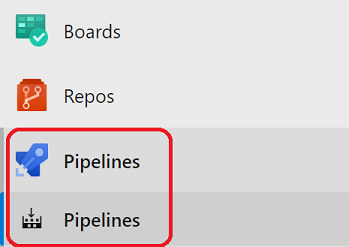

1. Select **New pipeline** to create a new build pipeline.  

    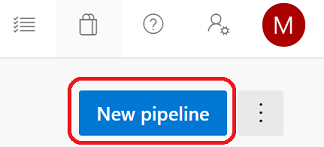

1. Select **Azure Repos Git** as the source.    

    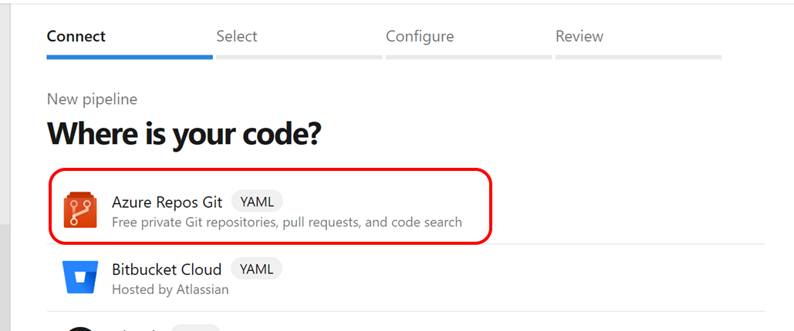

1. Next, select the **PartsUnlimited** repo.    

    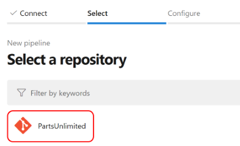

1. In the next screen, pick the ASP.NET template (we could start from an empty template, but the template has some tasks that will be needed anyway and simplifies the initial setup.)

    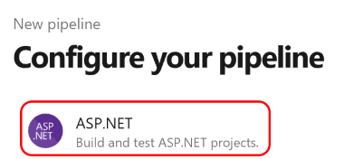

1. Looking at the YAML build pipeline, we can see that it looks like a markup file and contains code for some predefined tasks. By default, the pipeline will be saved as a new file called "azure-pipelines.yml" in the root of the repository and contains everything needed to build and test a typical ASP.NET solution. You can also customize the build as needed. 
1. In this case, update the pool to specify that the build should use a Visual Studio 2017 build VM and add some demands. Be sure to keep it at the same two-space indentation.
    ```
    name: Hosted VS2017
    demands:
    - msbuild
    - visualstudio
    - vstest
    ```
    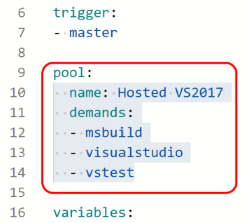
1. Let's test the build pipeline as is by queueing a new build. Click **"Save and run"** near the top.  

    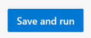

1. Update the commit message if you'd like. Leave the **Commit directly to the master branch** selected and click **"Save and run"** again to confirm the commit.  
    
    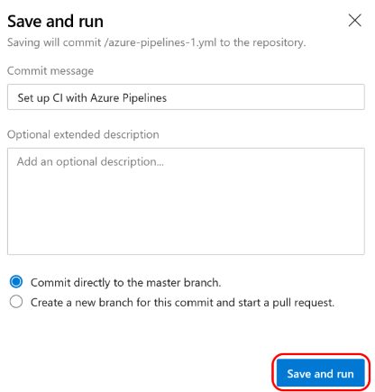

1. The page should update to a view of the build running. By clicking **"Job"** at the bottom, we can view the build log output as our project is being built on a hosted agent. If you want to review an earlier task, you can click to review its logs. Verify that the build is successful.  

    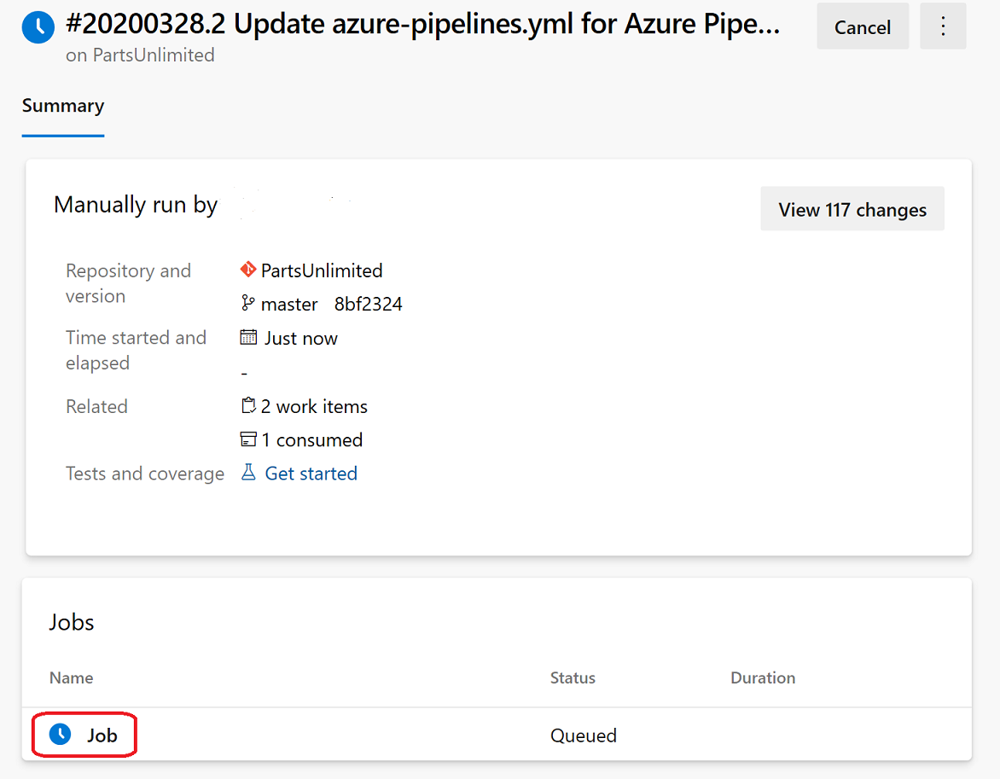

1. Select the **Tests** tab to review test results for this build.  

    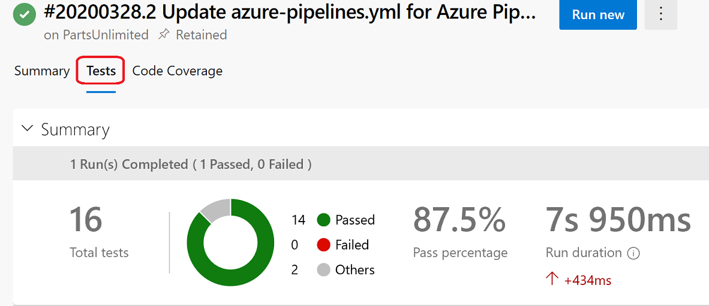

<div style="page-break-after: always;"></div>

### **Task 2: Adding Tasks to YAML Pipelines**
1. Now that our intial build and test processes are successful, we can make additional customizations. From the options(...) dropdown, select **Edit pipeline**.  

    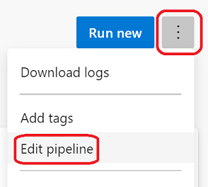

1. This should return you to the YAML editor view. Notice a task library that appears to the right. The library can be used to add tasks to your YAML file. This task library contains the same tasks as the Classic pipeline library. You can toggle this view by clicking the hide button as shown below. 

    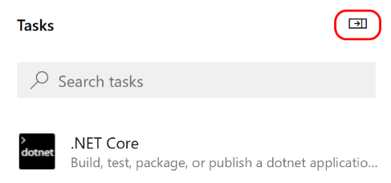

1. In order to be able to deploy the output of our build later, we need to add a task to publish the build output. This will save the output to Azure DevOps. Place the cursor on a blank line after the test step. Try to leave an extra blank line in between tasks to make the pipeline easier to read.  

    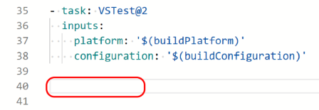

1. Search the tasks for **"publish pipeline"** and select the **Publish Pipeline Artifacts** task.  

    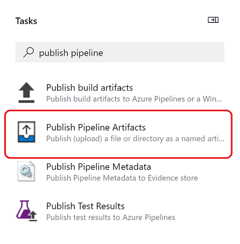

1. Change the **File or directory path** to publish to $(Build.ArtifactStagingDirectory). Enter the **Artifact name** as 'drop' and click **Add**. This task will publish the pipeline artifacts to a location in Azure DevOps that will be downloadable under the alias **drop**.  

    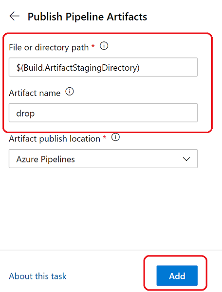

1. Review the code that was added where the cursor was. 

    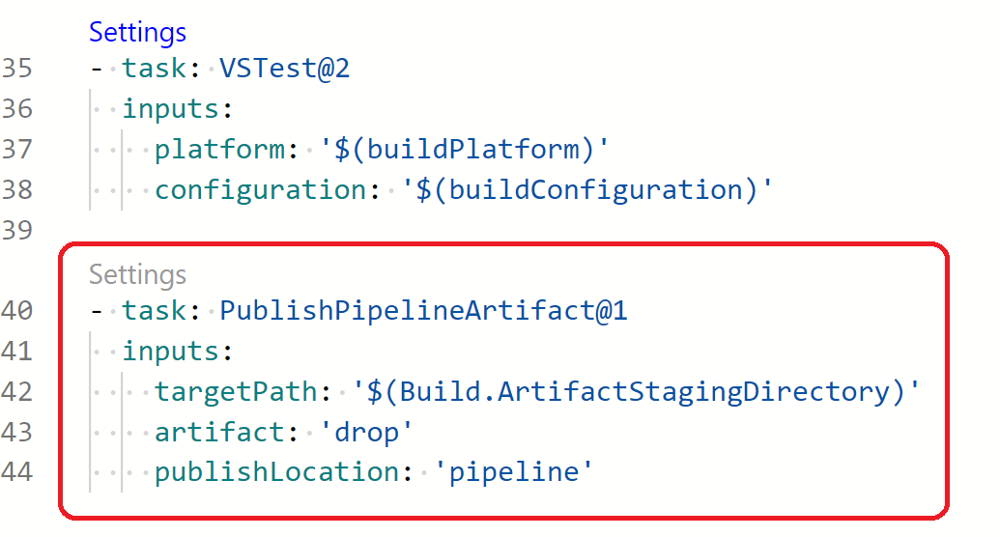

1. Before we save the changes, let's review what triggers this build. Near the top of the YAML file, notice the trigger is set to the master branch. This was set as part of the template we chose in Task 1. Since this YAML file is stored in the master branch, whenever we save a change to the file, a build will automatically be triggered.  

    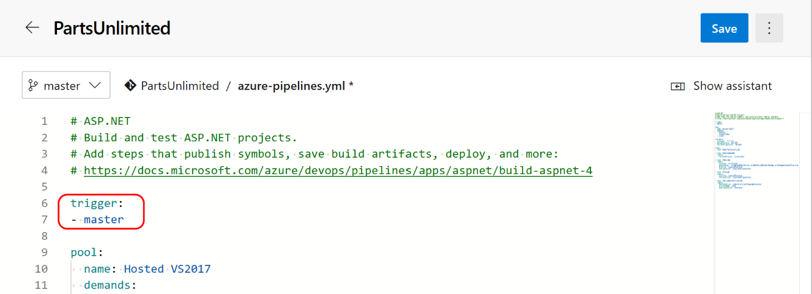    

1. To disable the trigger, modify the statement as shown below.   
    ```
    trigger: none
    ```  
    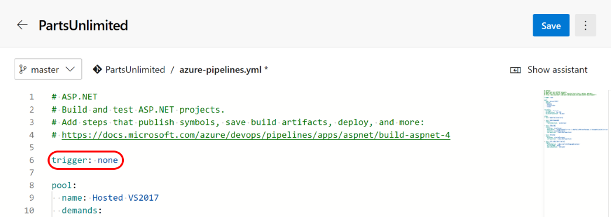 

1. Click **Save** in the top right corner.    

     

1. Update the commit message and click **Save** again to commit the changes. Notice no build has been triggered.  

    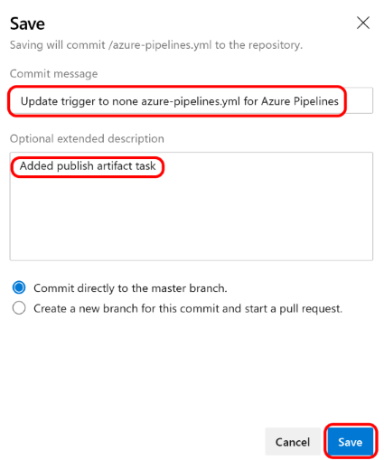 
1. Because we will need the continuous integration trigger in later sections, let's re-enable it. Change the statement back to include master.   
    ```
    trigger: 
    - master
    ```  
     

1. When you are ready to test the changes, click **Save**. Saving will commit the changes and now also initiate a new build due to the trigger that we just modified.   

     

1. Click **Save** again to save the changes and trigger a new build. 

    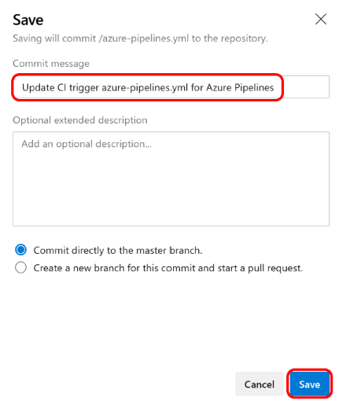 

1. Let's check for our new build. Return to the **Build Pipelines** view.  

    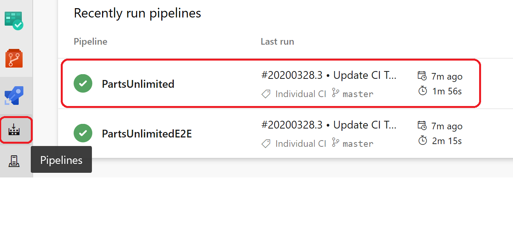

1. Ensure your YAML pipeline is selected. In the build history, there should be a new build with our commit message. Click the build run to open it. 

    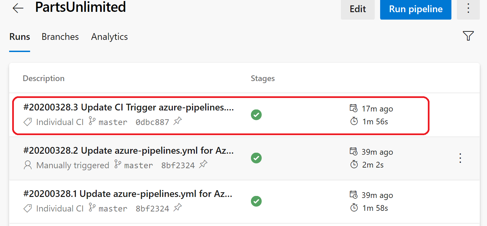

1. Again, review the build logs and wait for the build to complete. Once the build succeeds, view the newly created artifacts by clicking on **1 Published** next to the section that says **related**.  

    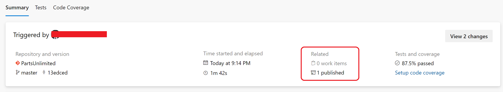

1. Expand the drop folder to view the contents.  

    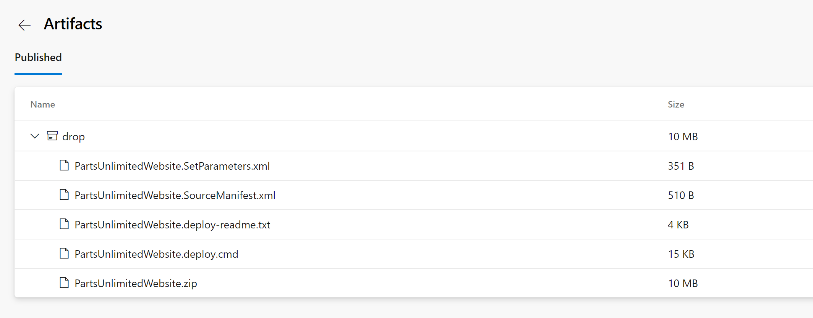

<div style="page-break-after: always;"></div>

### **Task 3: Invoking a Continuous Integration Build**
1. As you saw in the previous task, the pipeline was configured to support continuous integration as part of the template. In this section, we will trigger a build as part of a code change. Navigate to the code for this project using **Repos | Files**.  

    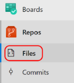

1. Open the file at **PartsUnlimited-aspnet45/src/PartsUnlimitedWebsite/Views/Home/Index.cshtml**  

    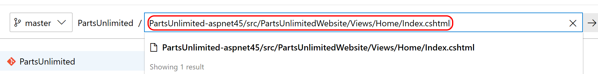

1. Click **Edit**.  

    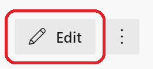

1. Make a minor cosmetic change, such as by tweaking the title of the document. Click **Commit**.  

    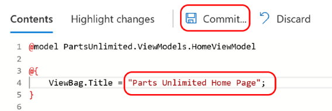

1. Add a **comment** and **link a work item** by expanding the drop down. For the purpose of the demo, you can choose any work item. We want to link a work item to show traceability in the later sections. Click **Commit**.  

    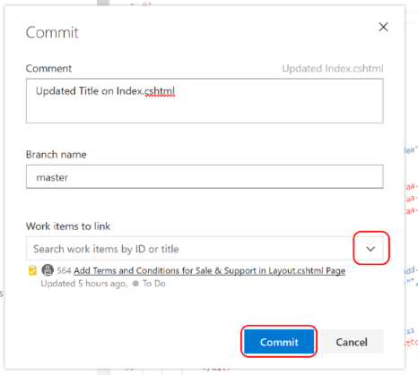

1. A build should be triggered shortly. Select **Pipelines | Pipelines** to see if it’s in progress.  
    
    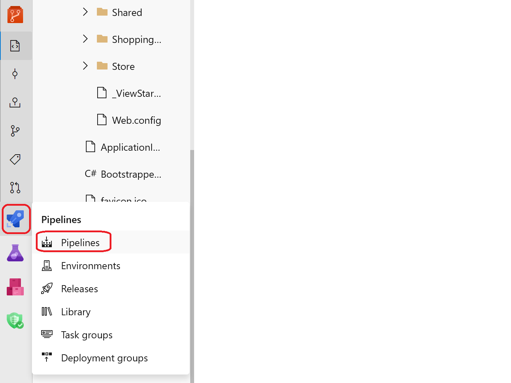

1. You should now see that a new build is in progress and that it was triggered by your change. Click the build to track it.  
    
    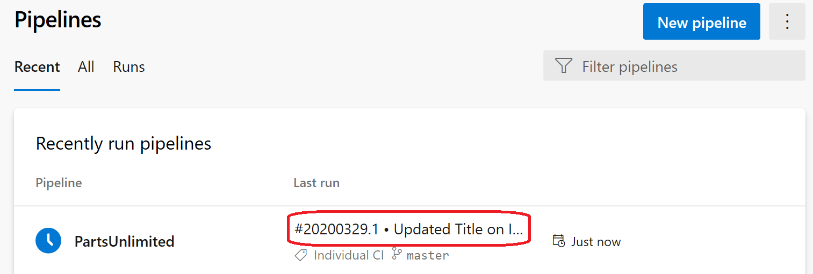

1. This build should run and succeed just like the previous build. Under the **Related** section we will see the linked work item. 

    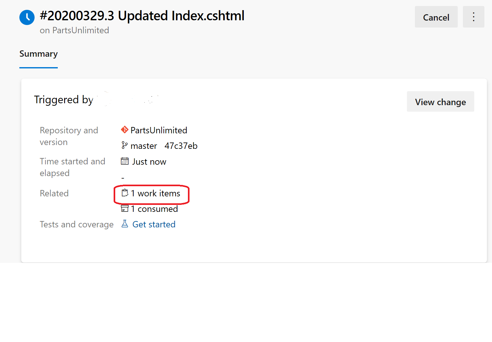

<div style="page-break-after: always;"></div>

### **Task 4: Monitor Code and Build KPIs**
1. Next, navigate to the Team Overview dashboard by clicking **Overview | Dashboards** from the left hand menu.  

    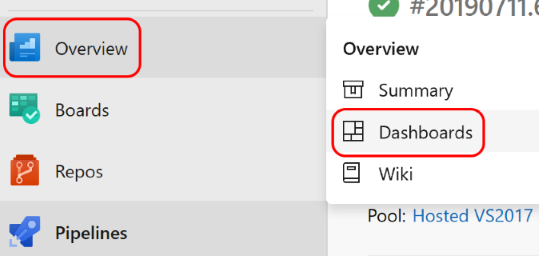

1. Click Edit. Note: If it's your first time navigating to the Dashboard area, you may have to additionally select the Overview Dashboard before you can click Edit.  

    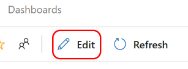

1. Add the **Code Tile** widget.  

    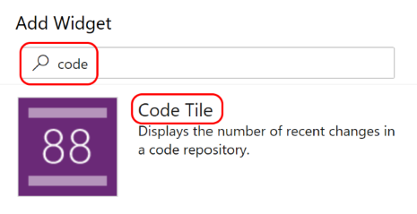

1. Configure the widget and point it to the master branch. Click **Save**.  
    
    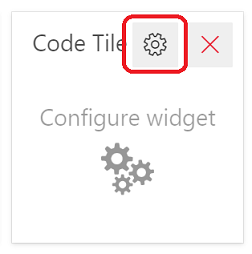 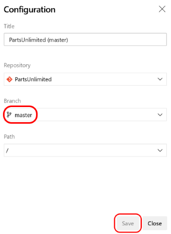

1. Next, add the **Build History** widget and point it to the build pipeline you created. Click **Save**.  

    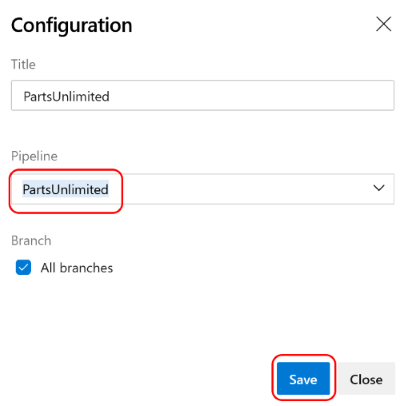

1. Click **Done Editing** near the top.  

    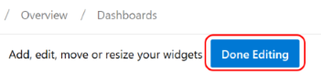

1. The team dashboard should now look similar to the below:  
    
    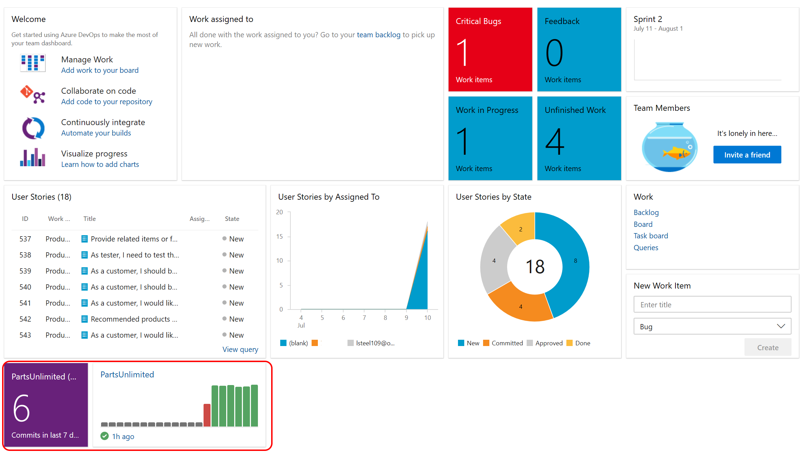


<div style="page-break-after: always;"></div>

### **Task 5: Publish Pipeline Artifacts**
1. In this task, we will copy the ARM templates from the Azure Repo to our pipeline artifacts drop location. Navigate back to the YAML pipeline by clicking **Pipelines** | **Pipelines** and selecting the YAML pipeline we have been working with.   

    

1. Next, click **Edit**.  

    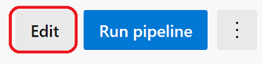

1. Between the **VS Test** and **Publish Pipeline Artifact** tasks, add two new blank lines and place your cursor in the middle. This will help make the tasks more readable as we add the next task from the library.  

    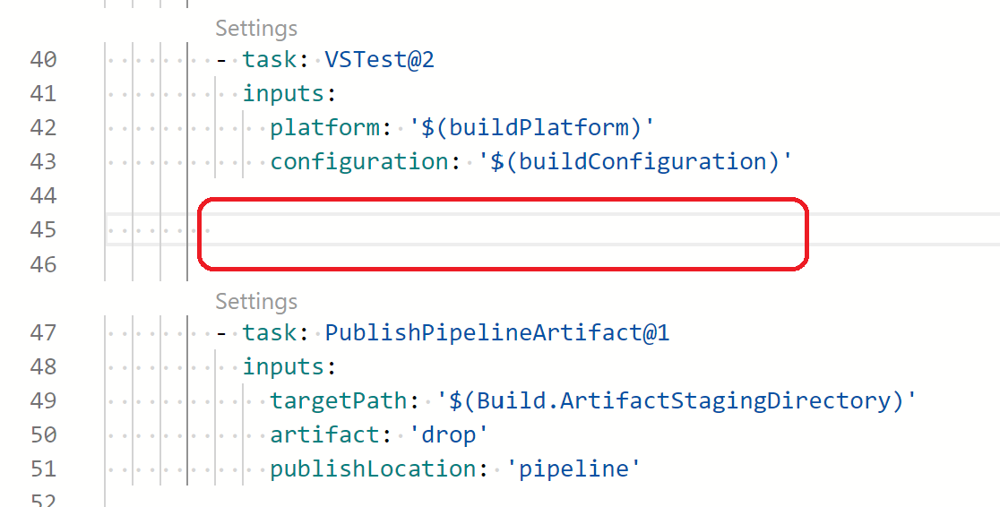

1. From the tasks library on the right, search for **copy** and select the **Copy Files** task.  

    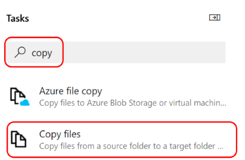

1. Add the following information. The contents filter will select all json files in the env folder and its subdirectories and copy them to the build artifacts folder. Click **Add**.  
    
    **SourceFolder:** \$(build.sourcesdirectory)/PartsUnlimited-aspnet45/env/    
    **Contents:** **/*.json     
    **TargetFolder:** \$(build.artifactstagingdirectory)     
      
    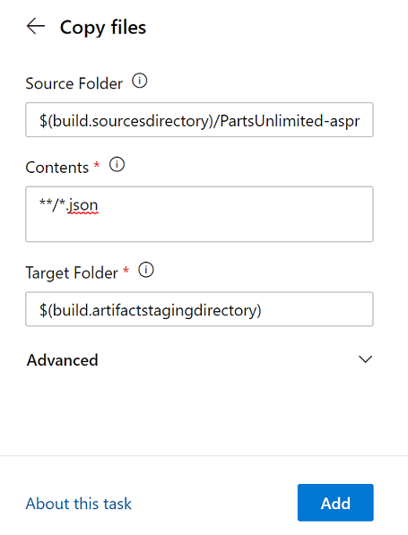

1. The YAML pipeline should now contain a copy files task as shown below.  

    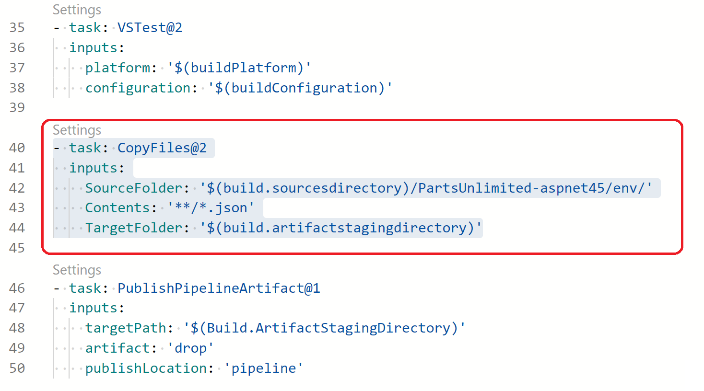

1. When you are ready to test the changes, click **Save**.  

     

1. Enter a commit message and click **Save** again.   

    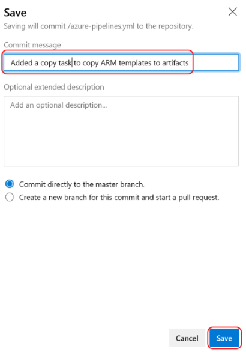

1. A new build should be triggered. Return to the **Build Pipelines** view to check.  

    

1. Ensure your YAML pipeline is selected. In the build history, there should be a new build with our commit message. Click the build run to open it.  

    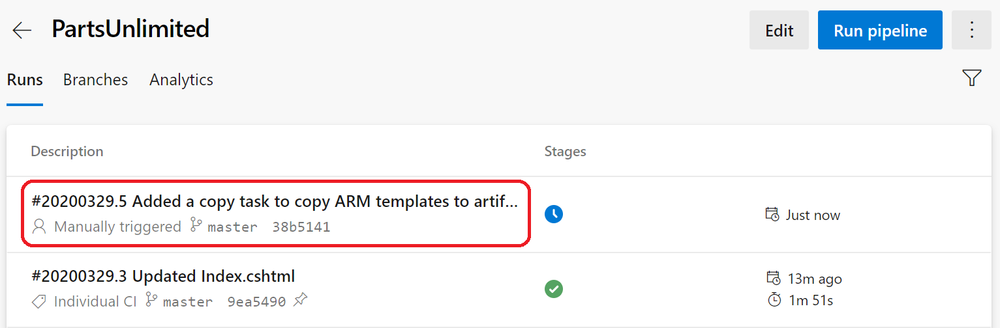

1. Again, review the build logs and wait for the build to complete. Once the build succeeds, view the newly created artifacts by clicking on **1 published**.  

    

1. Expand the drop folder to view the contents. We should see a folder with the ARM templates.  

    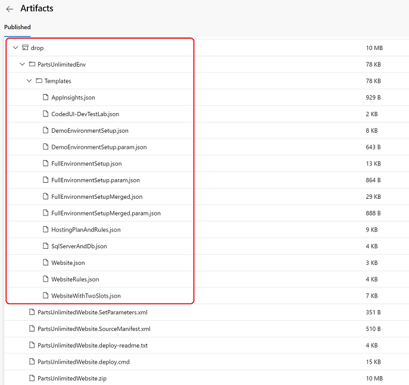
