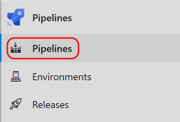
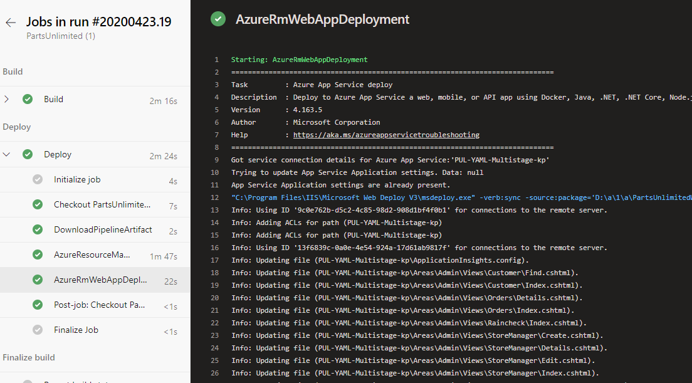

# Activate Azure with DevOps
## Module 06: End-to-End DevOps - Lab 03 - Multistage YAML Pipelines
### Student Lab Manual
**Conditions and Terms of Use**  
**Microsoft Confidential - For Internal Use Only**

This training package is proprietary and confidential and is intended only for uses described in the training materials. Content and software is provided to you under a Non-Disclosure Agreement and cannot be distributed. Copying or disclosing all or any portion of the content and/or software included in such packages is strictly prohibited.

The contents of this package are for informational and training purposes only and are provided "as is" without warranty of any kind, whether express or implied, including but not limited to the implied warranties of merchantability, fitness for a particular purpose, and non-infringement.

Training package content, including URLs and other Internet Web site references, is subject to change without notice. Because Microsoft must respond to changing market conditions, the content should not be interpreted to be a commitment on the part of Microsoft, and Microsoft cannot guarantee the accuracy of any information presented after the date of publication. Unless otherwise noted, the companies, organizations, products, domain names, e-mail addresses, logos, people, places, and events depicted herein are fictitious, and no association with any real company, organization, product, domain name, e-mail address, logo, person, place, or event is intended or should be inferred.

**Copyright and Trademarks**

© 2020 Microsoft Corporation. All rights reserved.

Microsoft may have patents, patent applications, trademarks, copyrights, or other intellectual property rights covering subject matter in this document. Except as expressly provided in written license agreement from Microsoft, the furnishing of this document does not give you any license to these patents, trademarks, copyrights, or other intellectual property.

Complying with all applicable copyright laws is the responsibility of the user. Without limiting the rights under copyright, no part of this document may be reproduced, stored in or introduced into a retrieval system, or transmitted in any form or by any means (electronic, mechanical, photocopying, recording, or otherwise), or for any purpose, without the express written permission of Microsoft Corporation.

For more information, see **Use of Microsoft Copyrighted Content** at [https://www.microsoft.com/en-us/legal/intellectualproperty/permissions/default](https://www.microsoft.com/en-us/legal/intellectualproperty/permissions/default)

Microsoft®, Internet Explorer®, and Windows® are either registered trademarks or trademarks of Microsoft Corporation in the United States and/or other countries. Other Microsoft products mentioned herein may be either registered trademarks or trademarks of Microsoft Corporation in the United States and/or other countries. All other trademarks are property of their respective owners.


Parts of this lab has been taken from [https://azuredevopslabs.com/labs/azuredevops/yaml/](https://azuredevopslabs.com/labs/azuredevops/yaml/). View additional publicly available labs at [https://azuredevopslabs.com/](https://azuredevopslabs.com/).

## Contents
[**Introduction**](#introduction)  
[**Prerequisites**](#prerequisites)       
[Exercise 1: Add stages to YAML Pipelines](#exercise-1-add-stages-to-yaml-pipelines)  
[Exercise 2: Download pipeline artifacts for the Deploy stage](#exercise-2-download-pipeline-artifacts-for-the-deploy-stage)  
[Exercise 3: Create Azure resources using YAML pipeline](#exercise-3-create-azure-resources-using-yaml-pipeline)    
[Exercise 4: Add task in the YAML pipeline to deploy the Web App](#exercise-4-add-task-in-the-yaml-pipeline-to-deploy-the-web-app)  
[Exercise 5: Review the deployed site](#exercise-5-review-the-deployed-site)  

# **Lab 6.3.1: End-to-End DevOps: Deploy using Multi-Stage YAML**
## **Introduction**
In this lab, you will create a pipeline using YAML to build the code, run the unit tests, create the infrastructure in Azure and deploy the app.

You'll learn:
- The basic features of multistage YAML pipelines
- Deploying infrastructure as code
- Understand the value of pipelines as code

## **Prerequisites**  
- Microsoft Azure subscription <https://azure.microsoft.com/>
- Lab 6.2 YAML Pipelines
- **Note**: You may want to disable other CI pipelines before starting the lab to prevent triggering multiple builds at once and causing agent delays in the queue
- If you've set up any branch policies on the master branch from the earlier labs, you may also need to temporarily disable those

**Estimated Time To Complete This Lab**  
60 minutes

<div style="page-break-after: always;"></div>

## **Exercise 1: Add stages to YAML Pipelines**  
  
1. Navigate to the project used in the previous (YAML Pipeline) lab in Azure DevOps.
1. Navigate to **Pipelines**, then **Pipelines**.  
  
     


1. Select and click on the YAML pipeline that we created in the build lab.  

    

1. From the menu on the right, select Edit.   

    

1. Now, first we will disable the Continuous Integration trigger so that saving the YAML file every time in this lab will not automatically trigger running of the pipeline. Change the **trigger** value to **none** like below:
    ```
    trigger:
    - none
    ```
    

1. We will add the stage configuration lines below after the **trigger** section to define a **Build** stage in the YAML pipeline. You can define any stages you need to better organize and track pipeline progress. It's important that everything lines up as shown in the screenshot below. Remove extra spaces if neccessary.
   ```
   stages:
   - stage: Build
     jobs:
     - job: Build
    ```  
     

1. Highlight the remainder of the YAML file and indent it four spaces (press Tab button twice). This will simply take the existing build definition and relocate it as a child of the **jobs** node. 

    

1. At the bottom of the file, add the configuration below to define a second stage.
   ```
   - stage: Deploy
     jobs:
     - job: Deploy
       pool:
         name: Hosted VS2017
       steps:
    ```
    

1. In this exercise we have modified the existing YAML pipeline created in the previous lab to divide it into two stages: **Build** and **Deploy**. In the next exercise, we will start adding tasks and steps under the newly defined Deploy stage.
  <div style="page-break-after: always;"></div>

## **Exercise 2: Download pipeline artifacts for the Deploy stage**

1. It’s important to note that the two stages created in the previous exercise will run independently. As a result, the output from the first stage (Build) will not be available to the second stage (Deploy) without special consideration. 

    For this, we should already have a task that publishes the pipeline artifacts at the end of the build stage from the previous lab. We need to add a another task to download these artifacts at the beginning of the deploy stage. Check your build stage to ensure you have a **Publish Pipeline Artifact** task at the end of the build stage.   
  
       

1. Place the cursor on the first line under the **steps** node of the deployment stage.   

     

1. Search the tasks for **download pipeline** and select the **Download Pipeline Artifacts** task.  

     

1. Set following values to the fields and then and click **Add**:   
    **Download artifacts produced by:** Current run     
    **Artifact name:** drop     
    **Matching patterns:** **   
    **Destination directroy:** $(System.ArtifactsDirectory) 

     

1. Indent the download task four spaces (two tabs) if it isn't already. You may also want to add an empty line before and after to make it easier to read.

     

1. In the next exercise we will now create the Azure resources using the JSON files downloaded in this task.

  <div style="page-break-after: always;"></div>

## **Exercise 3: Create Azure resources using YAML pipeline**

1. In this exercise, we will create required Azure resources (Azure Web App, Azure SQL Database, etc.) by using the ARM Template available in the repository and published and downloaded in the previous exercises. 

1. Move the mouse pointer on **Repos** and right-click on **Files**. Click on **Open link in new tab** to open repository in a new browser tab. 

     

1. Navigate to **PartsUnlimited-aspnet45/env/PartsUnlimitedEnv/Templates** and locate **FullEnvironmentSetupMerged.json** and **FullEnvironmentSetupMerged.param.json**. These are the two files we will use to build our Azure resources. Review these files.

     

1. Switch back to the browser tab for editing Pipelines. Place the cursor on the next empty line in the YAML file. In the **Tasks**, search for **ARM template deployment** task and click on it. 

     

1. This is the task that will take the ARM templates mentioned above and deploy Azure resources using those templates. Enter following information in this task:
   * **Deployment scope:** Resource Group  
   * **Azure Resource Manager Connection:** From the drop down, select the right subscription  
    **Note:** If Authorization is requested, click **Authorize** and follow the path to complete authorization.  

     

1. Once authorized successfully continue with following information:

   * **Subscription:** Select the correct subscription 
   * **Action:** Create or update resource group 
   * **Resource group:** PartsUnlimitedRG (This resource group will be created when the task runs) 
   * **Location:** East US 
   * **Template location:** Linked artifact  
   * **Template:** $(System.ArtifactsDirectory)/**/FullEnvironmentSetupMerged.json 
   * **Template parameters:** $(System.ArtifactsDirectory)/**/FullEnvironmentSetupMerged.param.json  
   * **Override template parameters:** -WebsiteName \$(WebsiteName) -PUL_ServerName \$(ServerName) -PUL_DBPassword \$(AdminPassword)  -PUL_DBPasswordForTest \$(AdminTestPassword) -PUL_HostingPlanName \$(HostingPlan) 
   * **Deployment mode:** Incremental  
   * Click **Add**

    

     

1. Your YAML file should now looks like this:

    

    **Note:** In case your sections are 'overindented' then you can select that entire section and press **Shift + Tab** twice to unindent the selected section.

1. We need to define the variables that we used in the previous step for overriding the template parameters. Click on **Variables** at the top-right of the screen.

    

1. Click on **New Variable** to add New Variable. Add **Name** as WebsiteName and **Value** as the name you intend to use for your website. 

    **Note:** Remember, the website name needs to be unique across all of Azure. You can achieve this by adding your initials at the end of the name.

    

1. Now we will define all the remaining variables mentioned in **Override template parameters** section above:  

    * **ServerName:** partsUnlimited-yaml-db-srv-[your initials] (Server name has to be unique across all of Azure. Add your initials in the server name to make it unique) 
    * **AdminPassword:** Pa$$w0rd (You can use any password you want and also check the box for **Keep this value secret**) 
    * **AdminTestPassword:** Pa$$w0rd (You can use any password you want and also check the box for **Keep this value secret**) 
    * **HostingPlan:** PUL-YAML
    * Click **Save**

    ```
    Note: If you decide to use some other password of your choice please make sure if meets following requirements:
        * Minimum of 8 characters
        * Requires 3 out of 4 of the following:
            ** Lowercase characters
            ** Uppercase characters
            ** Numbers (0-9)
            ** Symbols
        * Cannot contain the login name
    ```

      

1. At this point it'd be best to check if the above task creates the environment in Azure as we expect. We will save and run the pipeline before continuing to the next exercise. Click on **Save** at the top-right. 

      

1. Add a commit message and click **Save**.

      

1. Click on **Run** at the top-right corner and click **Run** again without making any changes.

       

      

1. Click on **Pipelines** and view the recent run triggered. Click on the run to view more details. 

    **Note:** As the Build stage finishes and Deploy stage starts, you maybe asked to **View** and provide permissions to Azure resources. Click on **Permit**.

      

    
    
    **Note:** You can also see the two stages (Build and Deploy) of the pipeline here.

1. Once the pipeline run is finished, you can see the summary like this:

    

1. Go to **[Azure Portal](https://www.portal.azure.com)** and navigate to the PartsUnlimitedRG that got created. It should list all the resources the deployment created:

    

    <div style="page-break-after: always;"></div>

## **Exercise 4: Add task in the YAML pipeline to deploy the Web App**  
1. Now that the environment is created in Azure, we will continue with adding the last task in the YAML pipeline to deploy the web app. Navigate back to **Azure DevOps** and to the project. Click on **Pipelines**, select the pipeline you were working on in the previous exercise. Click on **Edit Pipeline**.

1. Set the cursor on a new line at the end of the YAML definition. This will be the location where new tasks are added.  
    
1. Search the tasks for **"Azure App"** and select the **Azure App Service Deploy** task.  

    

1. Add following details in the task:

    * **Azure subscription:** Select the subscription used in the previous exercise
    * **App Service name:** $(WebsiteName)
    * **Package or folder:** $(System.ArtifactsDirectory)/**/*.zip
    * Click **Add**

      

1. The YAML that defines the task will be added to the cursor location in the file. Ensure it is indented and thus a child of the **steps** task. If not, indent it four spaces (two tabs).   

     

1. Click **Save** to commit the changes.   

     

1. Confirm the **Save** and **Run** the pipeline again.  

        

        
    
      

1.  Return to the **Pipelines** view and from the **Runs** tab, click the new run to open it. 

    

1. When the Build stage completes, click the **Deploy** stage to follow each task.  

      

1. Expand the **AzureRmWebAppDeployment** task to review the steps performed during the Azure deployment. Once the task completes, your app will be live on Azure.

    

  <div style="page-break-after: always;"></div>

## **Exercise 5: Review the deployed site**

1. Return to the Azure portal browser tab.  
1. Navigate to the **PartsUnlimitedRG** resource group. 
1. Click on **PUL-YAML-Multistage-kp** App Service

    

1. Click **Browse** to open your site in a new tab.  

      

1. The deployed site should load as below.
  
        

**Note:** Back in the **PartsUnlimitedRG** resource group, you might have noticed other App Services (Slot) and database servers with "dev" and "stage" suffixes. These can be used to deploy the application in mutiple phases/rings where deployment first goes to Dev and then to Stage and then finally to the Production environment. We will explore this in the next lab.

