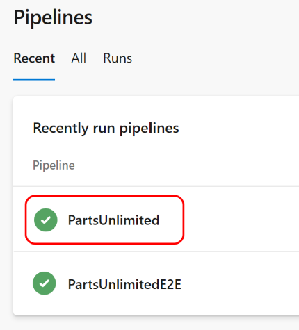

# Activate Azure with DevOps
## Module 06: End-to-End DevOps - Lab 03 - Multistage YAML Pipelines with Approvals
### Student Lab Manual
**Conditions and Terms of Use**  
**Microsoft Confidential - For Internal Use Only**

This training package is proprietary and confidential and is intended only for uses described in the training materials. Content and software is provided to you under a Non-Disclosure Agreement and cannot be distributed. Copying or disclosing all or any portion of the content and/or software included in such packages is strictly prohibited.

The contents of this package are for informational and training purposes only and are provided "as is" without warranty of any kind, whether express or implied, including but not limited to the implied warranties of merchantability, fitness for a particular purpose, and non-infringement.

Training package content, including URLs and other Internet Web site references, is subject to change without notice. Because Microsoft must respond to changing market conditions, the content should not be interpreted to be a commitment on the part of Microsoft, and Microsoft cannot guarantee the accuracy of any information presented after the date of publication. Unless otherwise noted, the companies, organizations, products, domain names, e-mail addresses, logos, people, places, and events depicted herein are fictitious, and no association with any real company, organization, product, domain name, e-mail address, logo, person, place, or event is intended or should be inferred.

**Copyright and Trademarks**

© 2020 Microsoft Corporation. All rights reserved.

Microsoft may have patents, patent applications, trademarks, copyrights, or other intellectual property rights covering subject matter in this document. Except as expressly provided in written license agreement from Microsoft, the furnishing of this document does not give you any license to these patents, trademarks, copyrights, or other intellectual property.

Complying with all applicable copyright laws is the responsibility of the user. Without limiting the rights under copyright, no part of this document may be reproduced, stored in or introduced into a retrieval system, or transmitted in any form or by any means (electronic, mechanical, photocopying, recording, or otherwise), or for any purpose, without the express written permission of Microsoft Corporation.

For more information, see **Use of Microsoft Copyrighted Content** at [https://www.microsoft.com/en-us/legal/intellectualproperty/permissions/default](https://www.microsoft.com/en-us/legal/intellectualproperty/permissions/default)

Microsoft®, Internet Explorer®, and Windows® are either registered trademarks or trademarks of Microsoft Corporation in the United States and/or other countries. Other Microsoft products mentioned herein may be either registered trademarks or trademarks of Microsoft Corporation in the United States and/or other countries. All other trademarks are property of their respective owners.


Parts of this lab has been taken from [https://azuredevopslabs.com/labs/azuredevops/yaml/](https://azuredevopslabs.com/labs/azuredevops/yaml/). View additional publicly available labs at [https://azuredevopslabs.com/](https://azuredevopslabs.com/).

## Contents
[**Introduction**](#introduction)  
[**Prerequisites**](#prerequisites)       
[Exercise 1: Split the Deploy stage into multiple stages](#exercise-1-split-the-deploy-stage-into-multiple-stages)  
[Exercise 2: Configure the Dev and Staging deployment stage](#exercise-2-configure-the-dev-and-staging-deployment-stage)    
[Exercise 3: Configure the Production deployment stage](#exercise-3-configure-the-production-deployment-stage)  
[Exercise 4: Review environments and setup Approval](#exercise-4-review-environments-and-setup-approval) 
[Exercise 5: Deploy the Web App to Multiple Environments](#exercise-5-deploy-the-web-app-to-multiple-environments)
[Exercise 6: Set the Approval on the Service Connection](#exercise-6-set-the-approval-on-the-service-connection)

# **Lab 6.3.2: End-to-End DevOps: Deploy using Multi-Stage YAML with Approvals**
## **Introduction**
In this lab, you will continue working with previous lab and modify the YAML pipeline to create environments and approvals. You will create approvals for both the stages in your pipeline as well as for the service connection.

You'll learn:
- Introducing environments in your YAML pipeline
- Implementing approvals in the deployment stages
- Implementing approval for the service connection

## **Prerequisites**  
- Microsoft Azure subscription <https://azure.microsoft.com/>
- Lab 6.3.1 - Previous Multistage YAML Pipelines lab

**Estimated Time To Complete This Lab**  
90 minutes

<div style="page-break-after: always;"></div>

## **Exercise 1: Split the Deploy stage into multiple stages**  
  
1. In this exercise, we will divide the "Deploy" stage created in the previous lab into multiple stages. The idea is to create three separate stages:
* **DeployAzureResources** - To deploy the ARM Template to create Azure resources in the Azure Portal
* **DeployToDevAndStaging** - To deploy the web application into Dev and Staging environments
* **DeployToProd** - To deploy the web app into the Production environment

The above is what we will use in this lab. This is just one example. Another way to split the deploy stage could be: ARM deployment, Dev deployment, Staging depoyment and Production deployment. Or combine all into a single Deploy stage. This is a design aproach for YAML that comes with pros and cons for each approach. We get greater control at the stage level when the pipeline runs. For example, we can skip or cancel the deployment to one of the environments without impacting other environments if they are split into separate stages. 

1. Navigate to [Azure DevOps](www.dev.azure.com). Navigate to the project we used in the last lab.

1. Navigate to **Pipelines**, then **Pipelines**.  
  
     

1. Select and click on the YAML pipeline that we worked on in the previous lab.  

    

1. From the menu on the right, select Edit.   

    

1. Navigate down to the Deploy stage of the YAML file. For convenience, you can **collapse** the Build stage so that only Deploy stage will be visible. This is the stage we will be working on in this lab.

    

1. Replace the stage name from Deploy to **DeployAzureResources** and job name to **DeployARMTemplate**

   ```
   - stage: DeployAzureResources
     jobs:
     - job: DeployARMTemplate

    ```  
     

1. We will also add **displayName**  lines for both the stage and the job to add friendly name to this stage and job. Similar *displayName* can be used for *stages, jobs, deployment jobs, and tasks* to make them more readable when the pipeline runs.

    ```
    
    - stage: DeployAzureResources
      displayName: Deploy Azure Resources  
      jobs:
      - job: DeployARMTemplate
        displayName: Deploy ARM Template

    ```  

    

1. We have successfully created the first stage of our deployment. Now, we will add **DeployToDevAndStaging** stage just before the Web App deployment task.

1. Place the cursor on the next line after the *AzureResourceManagerTemplateDeployment@3* is finished and before the *AzureRmWebAppDeployment@4* task begins. 

    

1. Here we will add the second stage **DeployToDevAndStaging** like below:

    ```
    - stage: DeployToDevAndStaging
      displayName: Deploy to Dev and Staging Environments
      jobs:
        - deployment: DeployToDev
          displayName: Deploy To Dev Environment

          pool:
            name: Hosted VS2017

    ``` 
    

    **Note:** At this point the YAML file might show syntax error. Ignore this for now. We will fix it in the next exercise.

    **Note:** Unlike the previous stage, instead of using *job* here, we are using *deployment* under Jobs. A [deployment job](https://docs.microsoft.com/en-us/azure/devops/pipelines/yaml-schema#deployment-job) is a special type of job tailored to an environment.

1. Similarly, we will create the last stage **DeployToProd** like below. Place this at the end of the YAML file after the web app deploy task.

    ```
    - stage: DeployToProd
      displayName: Deploy to Production
      jobs:
      - deployment: DeployToProd
        displayName: Deploy To Prod Environment

        pool:
            name: Hosted VS2017
    ```

    

1. Click **Save** at the top-right to save the changes mades so far. 

    **Note:** The YAML file, at this point, is incomplete and the pipeline cannot run. However, we have set **trigger: none** at the beginning of the YAML file in the previous lab. This will ensure that saving the modifications in the YAML file does not trigger Continuous Integration.

        

  <div style="page-break-after: always;"></div>

## **Exercise 2: Configure the Dev and Staging deployment stage**

1. In the previous exercise, we fully configured the first deploy stage (DeployAzureResources). However, the second deploy stage (DeployToDevAndStaging) is incomplete and we need to modify it in this exercise.  

1. In this stage, we will create Dev and Staging [environments](https://docs.microsoft.com/en-us/azure/devops/pipelines/yaml-schema#environment). We will also add tasks to deploy the Web App in the Dev and Staging slots of the Azure App Service.
    

1. Within the DeployToDevAndStaging Stage, place the cursor as shown below between **name: Hosted VS2017** and **- task: AzureRmWebAppDeployment@4** lines. Indent it inline with *Pool:*

     

1. Add following snippet and indent it as shown below. This will create the **PUL-Dev** environment.

    **Note:** We are using the simplest deployment strategy of runOnce. You can find additional details about the deployment strategies [here](https://docs.microsoft.com/en-us/azure/devops/pipelines/process/deployment-jobs?view=azure-devops#deployment-strategies). 

    ```
    environment: 'PUL-Dev'
    strategy:
        runOnce:
            deploy:
                steps:
    ```

     

1. Indent the **AzureRmWebAppDeployment@4** task appriopriately by pressing Tab until it aligns with **steps**. The stage should look like this:

     

1. Since this is the Dev stage, we want the Web App to be deployed to the Dev slot of the Azure App Service. Modify the **AzureRmWebAppDeployment@4** task to add the following lines after **WebAppName** and before **packageForLinux**:

    ```
        deployToSlotOrASE: true
        ResourceGroupName: 'PartsUnlimitedRG'
        SlotName: 'Dev'
    ```

        

1. We will also replace **\$(System.ArtifactsDirectory)** with **\$(Pipeline.Workspace)** in *packageForLinux:* value. This is to avoid having to add Download Pipeline Artifact task in every job under every stage. When we use the *deployment* job, it automatically downloads the published artifacts to $(Pipeline.Workspace)/{artifact} location.

    You can find more about Publish and Download Artifacts [here](https://docs.microsoft.com/en-us/azure/devops/pipelines/artifacts/pipeline-artifacts?view=azure-devops&tabs=yaml#artifacts-in-release-and-deployment-jobs).

    Your AzureRmWebAppDeployment@4 task should now look like below:

    

1. Next, we will add a snippet for the Staging environment. Copy the following *deployment* section.    

        

1. Paste this section on the next line after **AzureRmWebAppDeployment@4** task ends and before **DeployToProd** stage starts. Correctly indent the pasted section to align with the previous *DeployToDev* deployment job. **Note:** The first **DeployToDev** deployment job is collapsed for better readability.

       

     

    

1. Now, we will rename the second *DeployToDev* deployment job to **DeployToStaging**, rename *displayName* to **Deploy to Staging Environment**, and change the *environment* to **PUL-Staging**.  

        

1. We also want to ensure that *DeployToDev* deployment runs first and only after it is successfully finished, *DeployToStaging* starts. For enforcing this dependency, we will use **dependsOn**.

    ```
        deployment: DeployToStaging
        displayName: Deploy To Staging Environment
        dependsOn: DeployToDev
    
    ```

      

1. Lastly, we will change the *SlotName* to **Staging** in the **AzureRmWebAppDeployment@4** task. This deploys the web app to the Staging slot in this delpoyment job. 

        

1. Finally, before we start working on the last stage in the next exercise, **Save** the changes made so far.

    

  <div style="page-break-after: always;"></div>

## **Exercise 3: Configure the Production deployment stage**

1. Add an *environment* section to the last line of the YAML file. Set the environment name to **PUL-Production**

    ```
        environment: 'PUL-Production'
        strategy:
            runOnce:
                deploy:
                    steps:
    ```

     

1. Ensure the environment section is correctly indented to align with the *pool* section.

1. Set the cursor on a new line at the end of the YAML definition. This will be the location where our next task will be added for Azure App Service Deployment.
    
1. Copy and paste the **AzureRmWebAppDeployment@4** task from the previous stage and remove the following three lines:

    ```
    deployToSlotOrASE: true
    ResourceGroupName: 'PartsUnlimitedRG'
    SlotName: 'Staging'   
    ```

    

    **Note:** Since this is the Production environment, we are deploying the app in the production slot or in the actual Azure App Service instead of any slot of this App Service.


1. Click **Save** to commit the changes.   

        

    <div style="page-break-after: always;"></div>

## **Exercise 4: Review environments and setup Approval**  

1. Before we trigger the run of this pipeline, let's review the environments that got created after we saved the YAML file. We will also setup Approvals on the Production environment.

1. Click on **Environments** under the Pipelines section. Notice that three environments are automatically created: PUL-Dev, PUL-Staging and PUL-Production.   

     

    **Note:** Notice that the environments indicate that they were created just a few minutes ago (when we saved the YAML file) and have never been deployed to. We could have manually created these environments as well. However, it's easier to create those directly from the YAML definition.

1. Now, we want to ensure that deployments to the PUL-Production environment don't happen without the approval of an individual/group that is responsible for the Production releases. For this we will use **Approvals**.    

1.  Select the **PUL-Production** environment. Select the vertical "..." section at the top-right. Select **Approvals and Checks**

    

1. Select **Aprovals** and add yourself as the **Approver**.  Click **Create**.

      

      

  <div style="page-break-after: always;"></div>

## **Exercise 5: Deploy the Web App to Multiple Environments**

1. Let's run the pipeline to check if everything is working the way we are expecting.

1. Navigate back to Pipelines, select your YAML pipeline and click **Run pipeline**.

        

1. While we will not make any modifications at this time, select **Advanced Options**, expand **Stages to run**. You will notice all the stages we have configured in the YAML definitions are showing up here with the option to uncheck any of the stage. 

    Since we have combined the deployment of Dev and Staging environments into a single stage, we cannot unselect Dev or Staging independently. Click **Cancel**.

        

     

1. Click **Run** to start the pipeline. Review the summary.

    **Note:** Here you can see multiple stages under the **Stages** section. Also, notice the friendly names of those stages based on the *displayName* value in the YAML definitions.

      

1. Click **Jobs** to review the jobs defined in the YAML definitions.
  
        

1. At any time during the running of the pipeline, click on any stage or job to view more details.

      

1. As the deployment reaches the Production environment, it will pause for the review and approval first. Click on **Review** and **Approve** the deployment.

      

      

1. Also, back in the pipeline summary, click on **Environments** to review the deployment for all the environments.

      

1. As the deployment completes, we want to check our deployment in Azure. Navigate to the [Azure Portal](www.portal.azure.com). Select the PartsUnlimitedRG resource group and click on the App Service for the Dev slot. Click on **Browse** and verify that the site is running. Repeat this for the Staging slot and Production application. 

      

    <div style="page-break-after: always;"></div>

## **Exercise 6: Set the Approval on the Service Connection**

1. In this last exercise, we will set up Approval on the Service Connection used in the pipeline.

1. At this point, everyone should be quite comfortable navigating through Azure DevOps. Also, setting up an Approval on the Service Connection is very similar to setting the Approvals in Environments. For these reasons, the following steps are deliberately provided with fewer screenshots.

1. Navigate to **Project Settings** at the bottom-left of the Project you are working on.

1. Under the **Pipelines** section in the Project Settings, select **Service connections**.

1. Notice a Service connection has already been created. This service connection was created the first time  you authorized the connection from Azure DevOps to the Azure Portal in an earlier lab.

        

1. Select the Service connection and click on the vertical (...) to configure the settings of this connection.

1. Click on **Approvals and checks**. This UI should be similar to that of the Approvals and Checks for the Environments.

1. Select **Approvals** and add yourself as the approver. Click **Create**.

1. Run the pipeline again. In each stage that the service connections is invoked, the pipeline will now ask for an approval. This will protect unauthorized and unintended deployments from Azure DevOps into a particular Azure subscription!