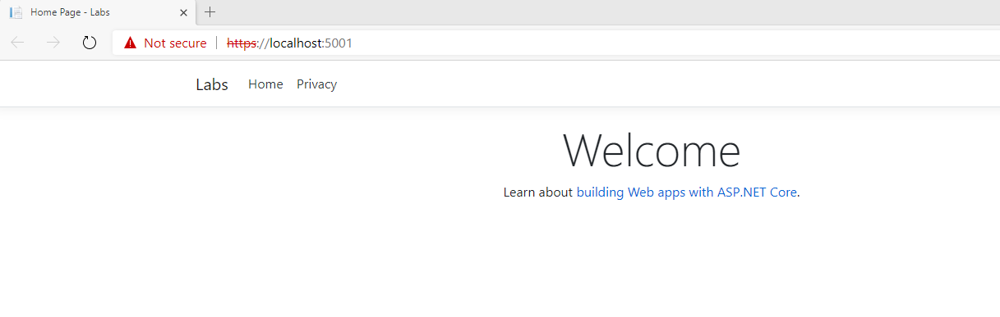

# Activate Azure with DevOps
## Module: Azure Web App Lab
### Student Lab Manual
**Conditions and Terms of Use**  
**Microsoft Confidential - For Internal Use Only**

This training package is proprietary and confidential and is intended only for uses described in the training materials. Content and software is provided to you under a Non-Disclosure Agreement and cannot be distributed. Copying or disclosing all or any portion of the content and/or software included in such packages is strictly prohibited.

The contents of this package are for informational and training purposes only and are provided "as is" without warranty of any kind, whether express or implied, including but not limited to the implied warranties of merchantability, fitness for a particular purpose, and non-infringement.

Training package content, including URLs and other Internet Web site references, is subject to change without notice. Because Microsoft must respond to changing market conditions, the content should not be interpreted to be a commitment on the part of Microsoft, and Microsoft cannot guarantee the accuracy of any information presented after the date of publication. Unless otherwise noted, the companies, organizations, products, domain names, e-mail addresses, logos, people, places, and events depicted herein are fictitious, and no association with any real company, organization, product, domain name, e-mail address, logo, person, place, or event is intended or should be inferred.

**Copyright and Trademarks**

© 2019 Microsoft Corporation. All rights reserved.

Microsoft may have patents, patent applications, trademarks, copyrights, or other intellectual property rights covering subject matter in this document. Except as expressly provided in written license agreement from Microsoft, the furnishing of this document does not give you any license to these patents, trademarks, copyrights, or other intellectual property.

Complying with all applicable copyright laws is the responsibility of the user. Without limiting the rights under copyright, no part of this document may be reproduced, stored in or introduced into a retrieval system, or transmitted in any form or by any means (electronic, mechanical, photocopying, recording, or otherwise), or for any purpose, without the express written permission of Microsoft Corporation.

For more information, see **Use of Microsoft Copyrighted Content** at [http://www.microsoft.com/about/legal/permissions/](http://www.microsoft.com/about/legal/permissions/)

Microsoft®, Internet Explorer®, and Windows® are either registered trademarks or trademarks of Microsoft Corporation in the United States and/or other countries. Other Microsoft products mentioned herein may be either registered trademarks or trademarks of Microsoft Corporation in the United States and/or other countries. All other trademarks are property of their respective owners.

## Contents
[**Introduction**](#introduction)  
[**Prerequisites**](#prerequisites)     
[**Exercise 1: Create Azure App Service (Web App) from the portal**](#Exercise-1-Create-Azure-App-Service-(Web-App)-from-the-portal)    
[**Exercise 2: Configure Azure App Service Extension**](#Exercise-2-Configure-Azure-App-Service-Extension)  
[**Exercise 3: Create and run ASP.NET Core MVC Application locally**](#Exercise-3-Create-and-run-ASP.NET-Core-MVC-Application-locally)    
[**Exercise 4: Deploy the application to Azure App Service**](#Exercise-4-Deploy-the-application-to-Azure-App-Service)  
[**Exercise 5: Modify the application locally and redeploy**](#Exercise-5-Modify-the-application-locally-and-redeploy)  
[**Exercise 6: [Self-Study] Deploy the application to a new App Service from VS Code**](#Exercise-6-[Self-Study]-Deploy-the-application-to-a-new-App-Service-from-VS-Code)    
 

# **Azure Web App Lab**
## **Introduction**
In this lab, you will create an Azure Web App (App Service) and deploy a sample .NET Core MVC Application created using Visual Studio Code into that Web App. You will then modify the application in VS Code and redeploy it to the Azure Web App. Finally, you will deploy the same application into a new Azure App Service, this time created from VS Code itself.

You'll learn:
- How to create Azure Web App from the portal
- How to deploy an application from VS Code to Azure App Service
- How to create an App Service from VS Code

## **Prerequisites**
The following is required to complete this hands-on lab:
- Microsoft [Visual Studio Code](https://code.visualstudio.com/download) with the C# extension installed
- The [Azure App Service extension](vscode:extension/ms-azuretools.vscode-azureappservice) for VS Code (installed from within VS Code)


**Estimated Time to Complete This Lab**  
30 minutes

<div style="page-break-after: always;"></div>

## **Exercise 1: Create Azure App Service (Web App) from the portal**
1. In a browser window, navigate to [https://portal.azure.com](http://portal.azure.com)
1. Sign into Azure Portal, click on **Create a resource** and select **Web App**    

     
1. Create a new **Resource Group** named **AzureWebAppLab** (name has to be unique across your subscription)

    

1. Create a Web App with following information:
    * **Name:** myFirstWebApp-abc (This name has to be unique across all of Azure. Replace abc with your initials to make it unique)
    * **Publish:** Code
    * **Runtime stack:** .NET Core 3.0
    * **Operating System:** Windows
    * **Region:** East US
    * **Windows Plan:** Create New and name it newASP
    * **Sku and size:** Standard S1

     

1. Click on **Review + create** and once the validation is complete, click on **Create**
1. Once the Web App gets created, it will show up in the resource group 
    
     

1. Click on the App Service (web app) that you just created
1. Click on **Browse** or on the URL for the app that was created
    
    

**Note:** At this time we have created an empty app that doesn't have any code in it. In the next exercises we will deploy the code in it.


<div style="page-break-after: always;"></div>

### **Exercise 2: Configure Azure App Service Extension**

1. Open Visual Studio Code.  
1. The Azure App Service extension provides convenient way to manage Azure App Service from Visual Studio. If you haven't installed it already,from the **Extensions** tab, search for “**Azure App Service**” and click **Install** to install it.  

     

1. Click **Reload** once the extension has finished installing. If this option is not available, reopen Visual Studio Code.  
1. Click on the Azure Explorer and click **Sign in to Azure**  
**Note:** If you have multiple Azure extensions installed, select the one for the area in which you're working, such as App Service, Functions, etc.

     
1. After signing in, verify that the email address of your Azure account (or "Signed In") appears in the Status Bar and your subscription(s) appears in the Azure explorer  

         

       

<div style="page-break-after: always;"></div>

### **Exercise 3: Create and run ASP.NET Core MVC Application locally**

We will use a sample ASP.NET Core MVC Application for this lab. There are several ways create an ASP.NET Core MVC Application. We will use the terminal of VS Code to create this application. 

1. Open the **New Terminal (Ctrl + Shift + `)** in Visual Studio Code and and switch to Powershell option in the drop-down at the top-right of the terminal window. Switch the root directory of the terminal where you want you to create the website.  

    

1. Execute following Command to create a web app using template ASP.NET Core MVC.  

    ```cmd
    dotnet new mvc
    ```    

    

1. Open the application in Visual Studio Code.      
    
         

1. After the directory is opened in VS Code, the solution might downlaod required packages and ask add required assets in the solution directory. Click **Yes**

    

1. Run the application locally. You can do this either by clicking Run option from the left pane of VS Code or by clicking **Run** and selecting **Run without Debugging** or by **Ctrl + F5**      
**Note:** As the application opens in the browser, it might display certificate warning. Accept the warning and continue.   

        

1. After you confirm the application is running locally, stop the session from VS Code.     

        


<div style="page-break-after: always;"></div>

### **Exercise 4: Deploy the application to Azure App Service**

We will now deploy this application to Azure App Service that we created in **Exercise 1**
1. From the **command palette (Ctrl+Shift+P)**, type "Deploy to web app" and select **Azure App Service: Deploy to Web App**
1. Select the default folder to zip and deploy the application  

    

1. You may get a prompt asking to add the required configuration to deploy. Select **Add Config**   

    

1. In the Command Palette, you should see the Azure App Service you created in Exercise 1. **Select myfirstwebapp-abc** 

    

    **Note:** If it prompts for the overwriting message, **Click Deploy.**  
    **Note:** If you are asked to enter the credentials for you Azure Subscription, enter correct credentials.  

1. Check the progress of the deployment in the  Terminal as well as in the bottom-right of VS Code. After the deployment is complete, **Click Browse Website**  

            

    

**Note:** Notice that the URL is https://myfirstwebapp-abc.azurewebsites.net. This indicates that this time you are browsing to the site hosted in Azure App Service. Congratulations, your web app is now live in Azure!

<div style="page-break-after: always;"></div>

### **Exercise 5: Modify the application locally and redeploy**
We will now make a small change in the application locally and then redeploy it to Azure App Service

1. In the explorer in VS Code, navigate to **Views -> Home -> Index.cshtml
1. Modify the **Welcome** header to **Welcome to my first web app!**

    

1. Save the changes (Crtl + S) and from the **Command Palette (Ctrl + Shift + P)** once more type "Deploy to web app" and select **Azure App Service: Deploy to Web App**    
1. Select the same myfirstwebapp-abc App Service again.
1. **Click Deploy** in the prompt asking the confirmation
1. Once the deployment is complete, browse to the application again and you should be able to see the changes you made.

    


<div style="page-break-after: always;"></div>

### **Exercise 6: [Self-Study] Deploy the application to a new App Service from VS Code**
In this last exercise we want you to deploy this same application to a different App Service into a different Resource Group. You want to create the required Azure resources from VS Code itself using the same Azure App Service extension.   

You can use the names of your choice for the Azure resources (Resource Group, App Service Plan and App Service) you will create.    

The steps for this exercise are deliberately not given so that everyone can explore the Azure App Service extension by themselves. Please work with the instructor if you have questions or if you get stuck anywhere.  